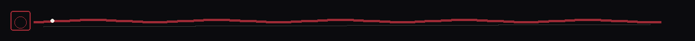
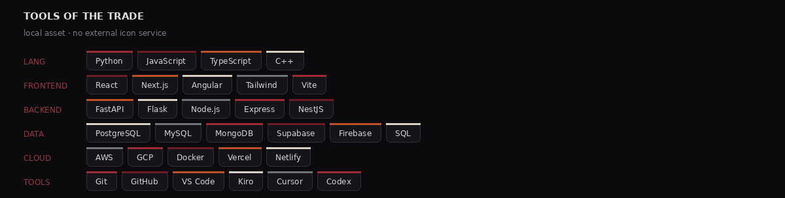

  

忍 &nbsp;·&nbsp; build quietly. let the work speak.

  

<a href="YOUR_LINKEDIN_URL"><kbd> LinkedIn </kbd></a>
&nbsp;&nbsp;&nbsp;
<a href="YOUR_LEETCODE_URL"><kbd> LeetCode </kbd></a>
&nbsp;&nbsp;&nbsp;
<a href="https://github.com/Abhishek09821"><kbd> GitHub </kbd></a>

<table>
<tr>
<td width="50%" valign="top">

### 影 / ABOUT

**Abhishek Tiwari**  
Full Stack Developer · AI Builder

I turn rough ideas into useful products.

`build → test → ship → repeat`

</td>
<td width="50%" valign="top">

### 道 / FOCUS

Python · React · TypeScript  
AI · Backend · Cloud

Building web products and intelligent tools.

</td>
</tr>
</table>

「 same curiosity. better code. bigger dreams. 」

