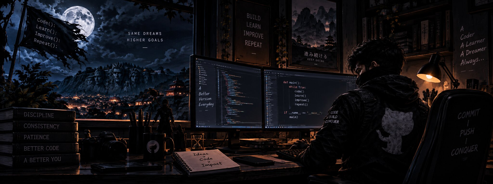

<a href="https://www.linkedin.com/in/abhishek-tiwari-3a3594300/">
<kbd> LINKEDIN </kbd>
</a>
&nbsp;&nbsp;&nbsp;
<a href="https://leetcode.com/u/abhishektiwari9821/">
<kbd> LEETCODE </kbd>
</a>
&nbsp;&nbsp;&nbsp;
<a href="https://github.com/Abhishek09821?tab=repositories">
<kbd> REPO </kbd>
</a>

---

### MY WORKS

<table>
<tr>

<td width="50%" valign="top">

**01 — FINMATE AI**

AI-powered personal finance platform focused on financial analysis, planning and intelligent decision-support.

`AI` `FinTech` `Full Stack`

</td>

<td width="50%" valign="top">

**02 — ARENA**

Interactive sports quiz platform with AI-generated questions, difficulty selection and customizable gameplay.

`AI` `React` `Quiz`

</td>

</tr>

<tr>

<td width="50%" valign="top">

**03 — ANYTHING CONVERTABLE**

A document-converting concept focused on converting PDFs and Word files easier to work with beyond traditional OCR workflows.

`Documents` `AI` `Product`

</td>

<td width="50%" valign="top">

**04 — REVERSEX**

A web reverse-engineering tool for uncovering architecture, UI patterns and technology signals.

`Reverse Engineering` `Web` `Analysis`

</td>

</tr>
</table>

---

### MY TOOLS

---

SYSTEM STATUS: ONLINE
&nbsp;&nbsp;•&nbsp;&nbsp;
MISSION: BUILD
&nbsp;&nbsp;•&nbsp;&nbsp;
MODE: ACTIVE

