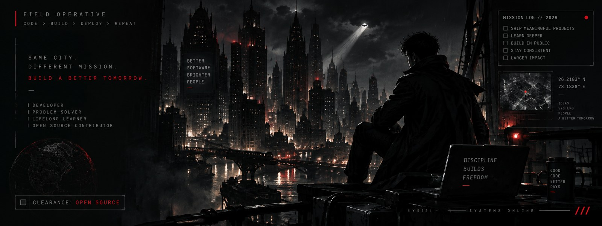
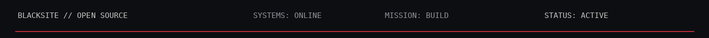
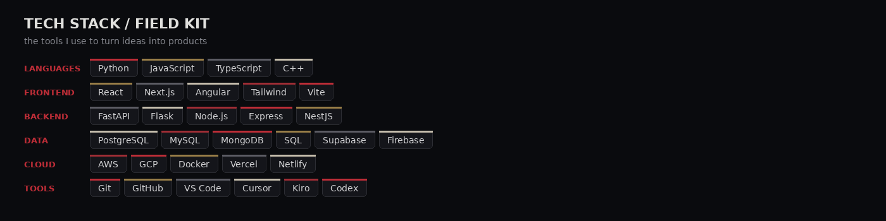

 

BLACKSITE // DEVELOPER DOSSIER &nbsp;•&nbsp; CLEARANCE: OPEN SOURCE

  

<a href="YOUR_LINKEDIN_URL"><kbd> LINKEDIN </kbd></a>
&nbsp;&nbsp;
<a href="YOUR_LEETCODE_URL"><kbd> LEETCODE </kbd></a>
&nbsp;&nbsp;
<a href="https://github.com/Abhishek09821"><kbd> GITHUB </kbd></a>

<table>
<tr>
<td width="52%" valign="top">

### PROFILE // 01

**Abhishek Tiwari**  
Full Stack Developer · AI Builder

I turn rough ideas into working products — from backend systems and AI features to polished web interfaces.

**Build style**  
product-first · backend-minded · iterate fast

</td>
<td width="48%" valign="top">

### ACTIVE INTEL // 02

**Building**  
AI-powered web products & developer tools

**Core**  
Python · React · TypeScript

**Also working with**  
FastAPI · Flask · PostgreSQL · Docker · Cloud

**Direction**  
better systems, cleaner interfaces, useful software

</td>
</tr>
</table>

### CASE FILES // 03

| PROJECT | WHAT IT IS |
|---|---|
| **FINMATE AI** | AI-first personal finance product with planning, analysis and decision-support workflows. |
| **VDown** | Media utility platform focused on downloading, subtitles and creator-oriented tooling. |
| **URCV** | Resume conversion and verification system built around document processing and AI workflows. |
| **ReverseX** | Web reverse-engineering concept for uncovering architecture, UI patterns and stack signals. |

FIELD NOTE — I care more about what the software does than how loud it looks.

