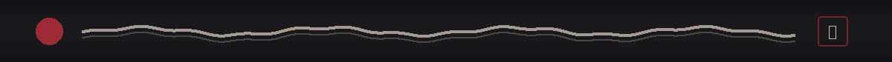

 

忍 — Build quietly. Let the work speak.

  

&nbsp;

&nbsp;

<table>
<tr>
<td width="54%" valign="top">

### 影  /  ABOUT

**Abhishek Tiwari**  
Full Stack Developer & AI Builder

I like turning rough ideas into products that actually work.

`build → test → ship → repeat`

</td>

<td width="46%" valign="top">

### 道  /  CURRENTLY

**Building** — AI + web products  
**Working with** — Python, React, TypeScript, JavaScript 
**Exploring** — Cloud, automation, intelligent apps  
**Home base** — India

</td>
</tr>
</table>

 

### 鍛  /  TOOLS OF THE TRADE

 

### ☯  /  FIND ME

 

 

<table align="center">
<tr>
<td align="center">

</td>
<td align="center">

</td>
</tr>
</table>

「 Same curiosity. Better code. Bigger dreams. 」

